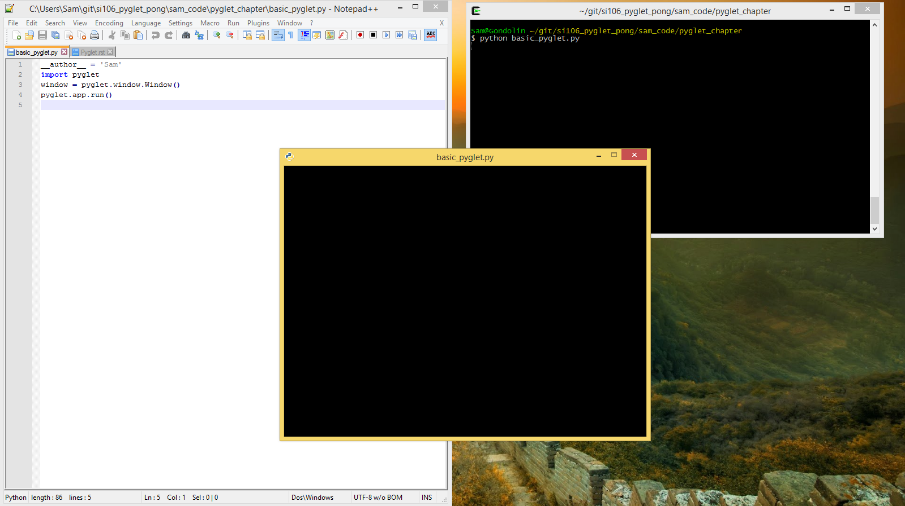
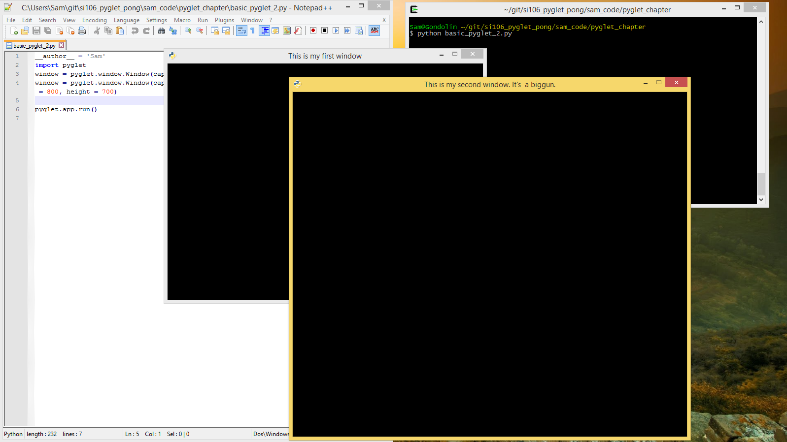
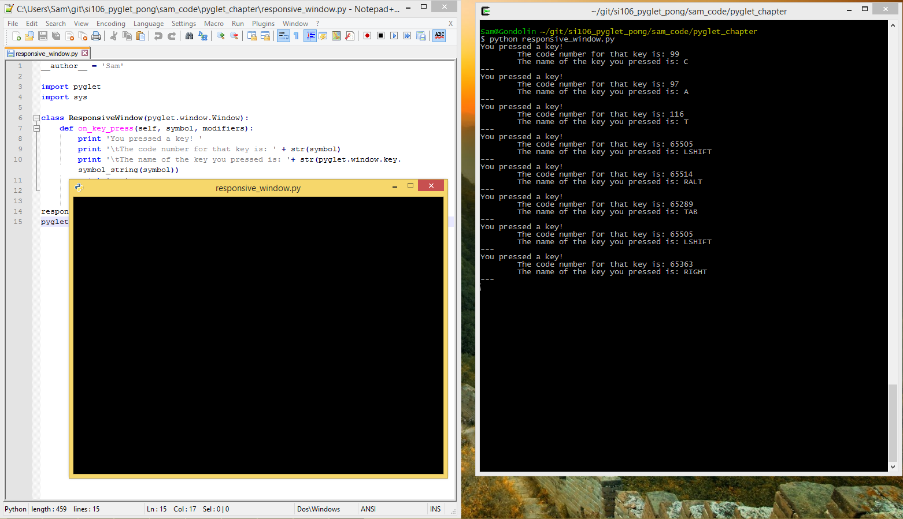
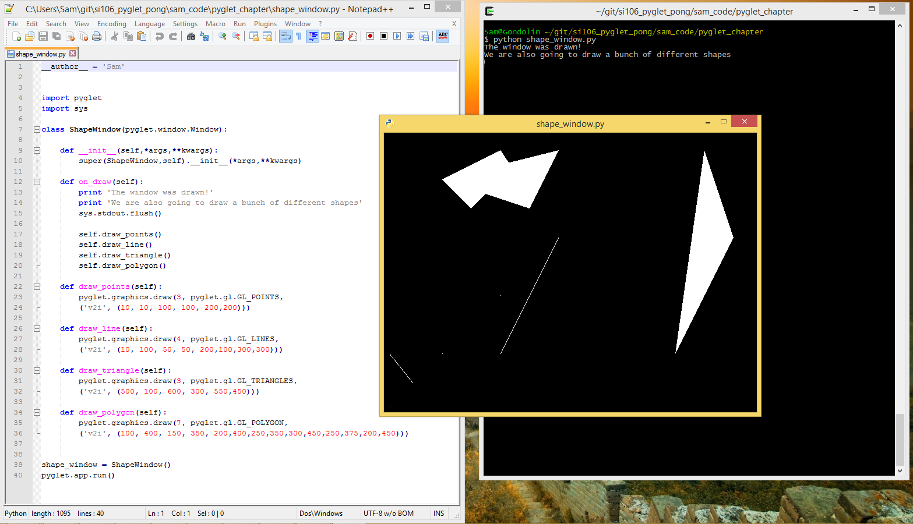

..  Copyright (C)  Brad Miller, David Ranum, Jeffrey Elkner, Peter Wentworth, Allen B. Downey, Chris
    Meyers, and Dario Mitchell.  Permission is granted to copy, distribute
    and/or modify this document under the terms of the GNU Free Documentation
    License, Version 1.3 or any later version published by the Free Software
    Foundation; with Invariant Sections being Forward, Prefaces, and
    Contributor List, no Front-Cover Texts, and no Back-Cover Texts.  A copy of
    the license is included in the section entitled "GNU Free Documentation
    License".

.. index:: compound data type

Pyglet
======

Pyglet (https://bitbucket.org/pyglet/pyglet/wiki/Home) is a "cross-platform windowing and multimedia library for Python." That means that it can be used to build visual applications with their own windows and elements such as text, moving images, sound, and responsiveness to user events such as key presses and mouse movements. 

This chapter will give a brief introduction to installing Pyglet and making (very) simple visual applications with it. 

As a note, Pyglet is not considered the best Python game library as of November 2015, as it hasn't been maintained consistently in recent years. PyGame (http://www.pygame.org/hifi.html) probably holds that distinction for now (though these things change quickly). 

However, Pyglet is simpler, more "Pythonic", and doesn't depend on anything. That makes it a better learning tool, and if you can understand Pyglet you can understand virtually any visual application library. 

The official Pyglet documentation is located here: https://bitbucket.org/pyglet/pyglet/wiki/Documentation

The Pyglet docs will go into much more detail about concepts that are only briefly discussed in this chapter. 

Installation
------------

Pyglet is an official Python package, meaning that it can be installed by simply running the following in the terminal:
::
	pip install pyglet
This will install Pyglet into the Lib/site-packages directory of your Python installation. To see a list of packages you've installed, use the command: 
::
	pip freeze -l
If you scroll down, you should see one called 'pyglet==1.2.4'. 

Alternatively, or if you run into problems, you can try following the official installation instructions available here: https://pyglet.readthedocs.org/en/pyglet-1.2-maintenance/programming_guide/installation.html

To confirm that Pyglet installed correctly, try running a little Python code (either by saving it with a text editor and running it from the terminal, or by running it in the interactive Python shell):

.. code:: python

	import pyglet 
	
If you don't get an error when you try to do that import, you can be pretty sure you've installed it correctly.

Basics of  Pyglet
-----------------
To understand Pyglet, you have to understand 4  basic things:

1) Creating windows

2) Running the Pyglet event loop

3) Getting your windows to listen for events

4) Making things happen in your windows

A Simple Pyglet App
~~~~~~~~~~~~~~~~~~~

We'll talk about these in that order. Below is just about the most simple Pyglet application you could possibly write. It demonstrates items 1) and 2):

.. code:: python

	import pyglet
	window = pyglet.window.Window()
	pyglet.app.run()

If you were to run this little program from the console, you'd see something like the following:

Application Elements
~~~~~~~~~~~~~~~~~~~~

So let's break this baby down line-by-line: 

.. code:: python

	import pyglet

This line imports the pyglet package that we installed earlier. It gives our program full access to all the functionality contained in the package. 

.. code:: python

	window = pyglet.window.Window()

This line creates the window that showed up in the screen shot. But, and this is important, **it does not draw the window.** For that, you need the next line:

.. code:: python

	pyglet.app.run()

**This is our get-the-ball rolling line.** It tells Pyglet to look for every object of a type it knows about (such as windows), and draw them on the screen. It also starts up what is called the **"Pyglet event loop"**, which is essentially a loop that runs over and over again, continuously waiting for user interaction, drawing stuff, making things happen, etc. All the stuff that constitutes a visual application, in fact.

Doesn't make sense? That's okay. The loopiness of the loop will become a little more clear in a bit. Til then, just remember that the second line creates the window, but the third line draws it and keeps it alive til you close it.

By default, the loop ends when all windows are closed. What that means is that we are stuck on that third line until all windows get closed. So if you add a print statement to the previous code:

.. code:: python

	import pyglet
	window = pyglet.window.Window()
	pyglet.app.run()
	print 'I made a window and ran the Pyglet event loop!'

...you'll find that you **do** see that print statement in the console, but not until you close the Pyglet window.

Fancier Windows
~~~~~~~~~~~~~~~

You can give your window a different title with the ``caption`` keyword argument, and different starting dimensions with the ``height`` and ``width`` arguments. You can also create multiple windows. The call to ``pyglet.app.run()`` will initialize them all.

.. code:: python

	import pyglet
	window = pyglet.window.Window(caption='This is my first window')
	window = pyglet.window.Window(caption="This is my second window. It's  a biggun.", width = 800, height = 700)
	pyglet.app.run()

Run this code, and you'll see something like the following:

Listening for events
--------------------
**Pyglet windows can listen for events.** When we say that, we don't mean that they literally listen for anything. What we mean is that when you have a window in focus, it knows when you, the user, do different things, such as:

- Mouse clicks

- Key presses

- Window resizing

- Lots of other stuff. The full list of listener functions can be found here_, under the "Events" heading.

.. _here: https://pyglet.readthedocs.org/en/pyglet-1.2-maintenance/api/pyglet/window/pyglet.window.Window.html#pyglet.window.Window.on_activate

Unfortunately, the default Pyglet window, the one we create when we say ``window = pyglet.window.Window()``, is boring. It can detect all these different kinds of events, but it doesn't actually do anything when any of them happen.

If you want a window that will respond to user events, you have to make it yourself, by **subclassing** the ``pyglet.window.Window`` class. In particular, you have to **overwrite** the methods of the Window class that are responsible for responding to user events. 

Listening for Key Presses
~~~~~~~~~~~~~~~~~~~~~~~~~

Here, we have created a subclass of ``pyglet.window.Window`` that we call ``ResponsiveWindow``. ``ResponsiveWindow`` overwrites the ``on_key_press()`` method of ``pyglet.window.Window``, which gets called whenever a key is pressed while the window is in focus. 

.. code:: python

	import pyglet
	import sys

	class ResponsiveWindow(pyglet.window.Window):
		def on_key_press(self, symbol, modifiers):
			print 'You pressed a key! '
			print '\tThe code number for that key is: ' + str(symbol)
			print '\tThe name of the key you pressed is: '+ str(pyglet.window.key.symbol_string(symbol))
			print '---'
			sys.stdout.flush()

	responsive_window = ResponsiveWindow()
	pyglet.app.run()

If you run this code, you'll get a window which is still empty, but which prints out any key you press as a console message:

Try not to worry too much about the ``sys.stdout.flush()`` business. That is just a bit of finagling to make sure that the print statements work correctly. 

So, to recap: we **subclassed** the ``pyglet.window.Window`` class, and overwrote the ``on_key_press()`` method in order to change how our subclass responded to key presses.

Other Kinds of Events
~~~~~~~~~~~~~~~~~~~~~

A good question at this point would be: **"What are the major event listener methods you can overwrite, and how do they work?"**

The answer can, again, be found in `the official documentation <https://pyglet.readthedocs.org/en/pyglet-1.2-maintenance/api/pyglet/window/pyglet.window.Window.html#pyglet.window.Window.on_activate>`_, but I'll list the important ones here:

Window.on_key_press(symbol,modifiers)
	This gets called whenever a key is pressed. ``symbol`` is a numeric code for the key that was pressed (e.g. 97 for 'A'), and ``modifiers`` is a number representing any other keys that are being held down at the same time (for if you wanted to differentiate shift+A from just A, for instance.)
	
Window.on_key_release(symbol, modifiers)
	This is very similar to ``on_key_press()``, only it gets called when a key is released. 

Window.on_mouse_press(x, y, button, modifiers)
	This method gets called whenever the mouse is clicked inside the window. ``x`` and ``y`` represent the coordinates inside the window where the press happened, and ``button`` represents which mouse button was clicked (e.g. 1 for the left mouse button). ``modifiers`` again represents any other keys currently being pressed, to differentiate between, say, shift-clicking and normal clicking. 

Window.on_mouse_drag(x, y, dx,dy, button, modifiers)
	This method gets called whenever the mouse dragged from one point in the window to a different point. ``x`` and ``y`` represent the coordinates of the initial point, and ``dx`` and ``dy`` represent how far in the x and y direction the mouse was dragged. 

Window.on_draw()
	This method is an important one. It gets called when the window is first drawn, and every time it is redrawn after that. If there is something that you always want to be in the window no matter what, then you should put it inside this method. 

Window.on_text(text)
	This method is sort of an alternative to on_key_press() for when you just want to interpret user input as text. ``text`` is the text that was entered. This will get called once for each individual key that is pressed. 
	
There are lots more of these things, which cover events such as the window being closed, the window being opened, the mouse being moved without clicking, the window being resized, etc. Check the documentation to see the whole set. 

Below is a version of the ResponsiveWindow class which has an overwritten method for each of those event handlers:

.. code:: python

	import pyglet
	import sys

	class ResponsiveWindow(pyglet.window.Window):
		def on_key_press(self, symbol, modifiers):
			print 'You pressed a key! '
			print '\tThe code number for that key is: ' + str(symbol)
			print '\tThe name of the key you pressed is: '+ str(pyglet.window.key.symbol_string(symbol))

			sys.stdout.flush()

		def on_key_release(self, symbol, modifiers):
			print 'You released a key! '
			print '\tThe code number for that key is: ' + str(symbol)
			print '\tThe name of the key you pressed is: '+ str(pyglet.window.key.symbol_string(symbol))
			sys.stdout.flush()

		def on_draw(self):
			print 'The window was drawn!'
			sys.stdout.flush()

		def on_mouse_press(self,x, y, button, modifiers):
			print 'You clicked the mouse!'
			print '\tYou clicked mouse button #'+str(button)
			print '\tYou clicked at coordinates: (' +str(x) + ',' + str(y) + ')'
			sys.stdout.flush()

		def on_mouse_drag(self,x, y, dx, dy, button, modifiers):
			print 'You dragged the mouse!'
			print '\tYou dragged mouse button #'+str(button)
			print '\tYou clicked at coordinates: (' +str(x) + ',' + str(y) + ')'
			print '\t...and dragged the cursor ' +str(x) + ' units horizontally and ' + str(y) + ' units vertically'
			sys.stdout.flush()

		def on_text(self,text):
			print 'You entered some text!'
			print '\tThe text you ented was: "'+text+'"'

	responsive_window = ResponsiveWindow()
	pyglet.app.run()

If you run this code and click the mouse a little, press a few keys, you should see some output similar to what I got in the console, where the window is telling me about the things I am doing to it:

.. image:: Images/responsive_window_2.png

Pyglet event loop revisited
~~~~~~~~~~~~~~~~~~~~~~~~~~~

As a final note on event listeners, this is what we meant by the "Pyglet event loop" we mentioned above. While the window is open, Pyglet is just looping around again and again, "listening" at each loop for things happening on the keyboard or the mouse, or what-have-you. If something happens, it calls the appropriate function, such as on_key_press(). If nothing happens, it does nothing.

Drawing things and making sounds
--------------------------------

Okay! At this point, you are probably wondering why we haven't shown you how to do anything other than create boring, empty windows. The truth is that you can draw all sorts of cool stuff inside a window, but it has to be in the context of an event handling function, even if it is just the on_draw() event that gets called any time anything changes. 

So you had to understand event handling before trying to draw anything was not going to be confusing. 

Displaying text
~~~~~~~~~~~~~~~

That said, here is some code that will draw some text in a (non-responsive) window:

.. code:: python

	import pyglet
	import sys

	class TextWindow(pyglet.window.Window):

		def __init__(self,*args,**kwargs):
			super(TextWindow,self).__init__(*args,**kwargs)

			self.label = pyglet.text.Label('Hello, world',
							  font_name='Times New Roman',
							  font_size=36,
							  x=self.width//2, y=self.height//2,
							  anchor_x='center', anchor_y='center')

		def on_draw(self):
			print 'The window was drawn!'
			print 'We are also going to draw some text, just because we can.'
			sys.stdout.flush()

			self.label.draw()

	text_window = TextWindow()
	pyglet.app.run()
	
We did a couple new things here. First, we overwrote not just the ``on_draw()`` method of ``pyglet.window.Window``, but also its constructor. Our version of the constructor doesn't do all that much--it just passes its input arguments on to the base constructor for ``pyglet.window.Window``. 

However, it does one crucial thing: it creates a ``pyglet.text.Label`` object called ``label``. And then in the ``on_draw()`` method, it calles the ``draw()`` method of this object, which tells it to draw itself in its containing window. 

And so, voila! We've succeeded in drawing something in our window:

.. image:: Images/text_window.png

For more information on displaying and formatting text, check the following documentation page: https://pyglet.readthedocs.org/en/pyglet-1.2-maintenance/programming_guide/text.html

Displaying Images
~~~~~~~~~~~~~~~~~

Displaying an image is similar to displaying a label. You'll have to create an object to hold the image, and then use the draw() method of that object to actually display it in the window. Rather than a ``pyglet.text.Label``, we'll use a ``pyglet.sprite.Sprite``. 

With images, there is an extra step involved: loading the image from the file system. To do this, we'll use the ``pyglet.image.load()`` function.

Here's some code that shows how these elements work together to display an image. It depends on a file named 'white_square.png' existing in the same directory as the .py file, so if you want to try it out you will have to supply your own image:

.. code:: python

	import pyglet
	import sys

	class ImageWindow(pyglet.window.Window):

		def __init__(self,*args,**kwargs):
			super(ImageWindow,self).__init__(*args,**kwargs)

			image = pyglet.image.load('white_square.png')
			self.image_sprite = pyglet.sprite.Sprite(image,
					  x=self.width//2, y=self.height//2)

		def on_draw(self):
			print 'The window was drawn!'
			print 'We are also going to draw a square, because squares are amazing'
			sys.stdout.flush()

			self.image_sprite.draw()

	image_window = ImageWindow()
	pyglet.app.run()

Running this code gives the following:

.. image:: Images/image_window.png

It's worth a little more discussion of the Sprite class, since if you build a visual application such as a game, you are most likely going to be creating and manipulating a lot of Sprites. So: a Sprite represents a persistent game object. The class has a number of instance variables and methods associated with it. Here are a few important ones:

- x and y: these instance variables represent the lower left corner of the Sprite

- set_position(x,y): this method moves the Sprite to a new position. If you want to move a game object in-game, you should use this method.

- width and height: these variables represent the width and height of the Sprite. They are calculated automatically from the image that the Sprite is based on. 

- draw(): This method draws the Sprite within its containing window. If you want to have a game object move, one way of doing so is to change its position with set_position(), clear the window using the Window.clear() method, and then draw the Sprite again using this method. 

- delete(): This method deletes the Sprite. 

The full documentation for the class is available here: http://pyglet.readthedocs.org/en/latest/api/pyglet/sprite/pyglet.sprite.Sprite.html

Displaying Geometric Primitives
~~~~~~~~~~~~~~~~~~~~~~~~~~~~~~~

You can draw geometrics shapes in a window by using the ``pyglet.graphics.draw()`` function.

The syntax for this function goes generally as follows: 

.. code:: python

	pyglet.graphics.draw(number_of_vertices,shape_type,shape_tuple)
	# number_of_vertices: number of vertices that will be used to define this shape (e.g. 3 for a triangle)
	# shape_type: one of a set of shape types defined by Pyglet. See https://pyglet.readthedocs.org/en/pyglet-1.2-maintenance/programming_guide/graphics.html#drawing-primitives for the full list.
	# shape_tuple: a two-element tuple of the form (format_string,vertex_tuple)
	#	format_string is a string that describes how the tuple_vertex should be interpreted. You can see various options for this in the link above, but sticking with 'v2f' is good to start with. 
	#	vertex_tuple is a tuple consisting of two elements per vertex, an x coordinate and a y coordinate. 

This is probably hard to understand, so here is some code that draws various kinds of shapes:

.. code:: python

	import pyglet
	import sys

	class ShapeWindow(pyglet.window.Window):

		def __init__(self,*args,**kwargs):
			super(ShapeWindow,self).__init__(*args,**kwargs)

		def on_draw(self):
			print 'The window was drawn!'
			print 'We are also going to draw a bunch of different shapes'
			sys.stdout.flush()

			self.draw_points()
			self.draw_line()
			self.draw_triangle()
			self.draw_polygon()

		def draw_points(self):
			pyglet.graphics.draw(3, pyglet.gl.GL_POINTS,
			('v2i', (10, 10, 100, 100, 200,200)))

		def draw_line(self):
			pyglet.graphics.draw(4, pyglet.gl.GL_LINES,
			('v2i', (10, 100, 50, 50, 200,100,300,300)))

		def draw_triangle(self):
			pyglet.graphics.draw(3, pyglet.gl.GL_TRIANGLES,
			('v2i', (500, 100, 600, 300, 550,450)))

		def draw_polygon(self):
			pyglet.graphics.draw(7, pyglet.gl.GL_POLYGON,
			('v2i', (100, 400, 150, 350, 200,400,250,350,300,450,250,375,200,450)))

	shape_window = ShapeWindow()
	pyglet.app.run()

If we run this code, we should see a window with the various points, lines and shapes we plotted out:

Making Sounds
~~~~~~~~~~~~~
Pyglet can also be used to make sounds. Doing so is a three step process:

1) Tell Pyglet what audio driver to use 

2) Load a sound file into a Pyglet object with ``pyglet.media.load``

3) Use that object's ``play()`` method. 

Here is some code that demonstrates this:

.. code:: python

	import pyglet
	import sys

	class SoundWindow(pyglet.window.Window):

		def __init__(self,*args,**kwargs):
			super(SoundWindow,self).__init__(*args,**kwargs)
			
			#Tell pyglet what driver to use
			pyglet.options['audio'] = ('openal', 'silent')
			
			#Load a sound file into a Pyglet object
			self.source = pyglet.media.load('bicycle_bell.wav',streaming=False)

		def on_draw(self):
			print 'The window was drawn!'
			print 'We are going to make a noise'
			sys.stdout.flush()
			self.make_sound()

		def make_sound(self):
			# Use the object's play() method
			self.source.play()

	sound_window = SoundWindow()
	pyglet.app.run()

We won't show a screenshot of the result as they are not visual, but trust us--it works. Note that we set the keyword argument ``streaming=False`` in our invocation of ``pyglet.media.load``. This allows us to play the sound multiple times, which in most cases we will want to do. However, if you only wanted to play a sound once, you could omit this parameter. 

If you want to run this code for yourself, you will have to download a .wav file and put it in the same directory as this script. The one used in the example can be found here: http://www.wavsource.com/snds_2015-11-01_1874590815319647/sfx/bicycle_bell.wav

The full documentation on making sounds (and video) in Pyglet can be found here: https://pyglet.readthedocs.org/en/pyglet-1.2-maintenance/programming_guide/media.html

Putting it all together
-----------------------

The ultimate goal is to put drawing objects together with event detection to create interactive visual applications.

Here we give one example, a simple little game that lets the player move a white square around the window using the arrow keys, and which makes a jingling noise when they hit the space key:

.. code:: python

	import pyglet
	import sys

	class GameWindow(pyglet.window.Window):

		square_speed = 6

		def __init__(self,*args,**kwargs):
			super(GameWindow,self).__init__(*args,**kwargs)

			image = pyglet.image.load('white_square.png')
			self.image_sprite = pyglet.sprite.Sprite(image,
					  x=self.width//2, y=self.height//2)

			pyglet.options['audio'] = ('openal', 'silent')
			self.source = pyglet.media.load('bicycle_bell.wav',streaming=False)

		def on_key_press(self, symbol, modifiers):
			'''
			If the user presses an arrow key, move the square accordingly.
			If they press space bar, make a noise.
			If they press Q or ESC, quit
			:param symbol:
			:param modifiers:
			:return:
			'''

			if symbol == pyglet.window.key.Q or symbol == pyglet.window.key.ESCAPE:
				print 'Exit key detected. Exiting game...'
				exit(0)
			elif symbol == pyglet.window.key.SPACE:
				self.make_sound()
			elif symbol == pyglet.window.key.UP:
				self.image_sprite.set_position(self.image_sprite.x,self.image_sprite.y+self.square_speed)
			elif symbol == pyglet.window.key.DOWN:
				self.image_sprite.set_position(self.image_sprite.x,self.image_sprite.y-self.square_speed)
			elif symbol == pyglet.window.key.RIGHT:
				self.image_sprite.set_position(self.image_sprite.x+self.square_speed,self.image_sprite.y)
			elif symbol == pyglet.window.key.LEFT:
				self.image_sprite.set_position(self.image_sprite.x-self.square_speed,self.image_sprite.y)

		def on_draw(self):
			print 'The window was drawn!'
			print 'We are also going to draw a square, because squares are amazing'
			sys.stdout.flush()
			self.clear()
			self.image_sprite.draw()

		def make_sound(self):
			self.source.play()

	game_window = GameWindow()
	pyglet.app.run()

You can see that most of the "game logic", such as it is, takes place in the ``on_key_press()`` method. In this method, the game interprets the key being pressed, and makes a decision about what to do based on what key was pressed. The ``on_draw()`` method updates the window to accommodate the new situation, such as the changing position of the image sprite. 

Most games, at least most simple games, are going to look like this: a few visual elements that move around and change based on user input, as interpreted through event-handling functions such as ``on_key_press()`` or ``on_mouse_click()``.

Other important stuff
---------------------

An important pair of methods to know are ``pyglet.clock.schedule_interval()`` and ``pyglet.clock.unschedule()``

``pyglet.clock.schedule_interval(function,interval)`` takes two arguments, ``function`` and ``interval``. ``function`` should be a function name, while ``interval`` is a float representing some number of seconds. ``schedule_interval`` causes the Pyglet event loop to "schedule" the function to run on the given interval. 

``pyglet.clock.unschedule(function)`` tells Pyglet to pull the given function off the scheduler. Below is an example of the two functions being used in conjunction with one another:

.. code:: python

	import pyglet

	print_count = 0

	def print_1(interval):
		global print_count
		print_count += 1

		if print_count <= 5:
			print 'First printing function. Count: ' + str(print_count)
			print '\tIt has been ' + str(interval) +' seconds since the last time this function was called.'

		else:
			print 'Unscheduling first printing function and scheduling second printing function'
			pyglet.clock.unschedule(print_1)
			pyglet.clock.schedule_interval(print_2,1.0)

	def print_2(interval):
		global print_count
		print_count += 1
		if print_count <= 10:
			print 'Second printing function. Count: ' + str(print_count)
			print '\tIt has been ' + str(interval) +' seconds since the last time this function was called.'

		else:
			print 'Exiting Pyglet event loop'
			pyglet.app.exit()

	print 'Scheduling first printing function'
	pyglet.clock.schedule_interval(print_1,1.0)
	print 'Starting up game loop'
	pyglet.app.run()
		
If you were to run this code, you'd see some output, printed at a 1-second interval:

.. code::

	Scheduling first printing function
	Starting up game loop
	First printing function. Count: 1
		It has been 1.00017619269 seconds.
	First printing function. Count: 2
		It has been 1.00004148226 seconds.
	First printing function. Count: 3
		It has been 1.00059999598 seconds.
	First printing function. Count: 4
		It has been 1.00077661632 seconds.
	First printing function. Count: 5
		It has been 1.00115594379 seconds.
	Unscheduling first printing function and scheduling second printing function
	Second printing function. Count: 7
		It has been 1.00012017026 seconds.
	Second printing function. Count: 8
		It has been 1.00039814416 seconds.
	Second printing function. Count: 9
		It has been 1.00042337564 seconds.
	Second printing function. Count: 10
		It has been 1.00041952677 seconds.
	Exiting Pyglet event loop

What happened here was that initially we scheduled ``print_1()`` to run on a once-per-second interval. But, when print_count exceeded 5, ``print_1()`` unscheduled itself and scheduled ``print_2()`` to run on the same interval. When print_count exceeded 10, ``print_2()`` exited the game using the ``pyglet.game.exit()`` function. 

Note that both of my scheduled functions had an argument called ``interval``. The Pyglet scheduler passes the actual interval that has passed, as an argument to the scheduled function whenever it runs. This is usually very close to the planned interval, but slightly different due to CPU latency and stuff like that. 

Additional Notes
----------------

The Pyglet documentation available at https://pyglet.readthedocs.org/en/pyglet-1.2-maintenance/index.html goes into much more detail than this introduction. 

However, this documentation, rather than using subclassing, uses something called **function decorators**, to achieve the function overwrites that it needs to produce real results. This approach produces identical results to subclassing, but is slightly more compact (though also, in our opinion, harder to understand).

The documentation discusses this design decision and alternatives to it, such as subclassing, here: https://pyglet.readthedocs.org/en/pyglet-1.2-maintenance/programming_guide/windowing.html#subclassing-window

