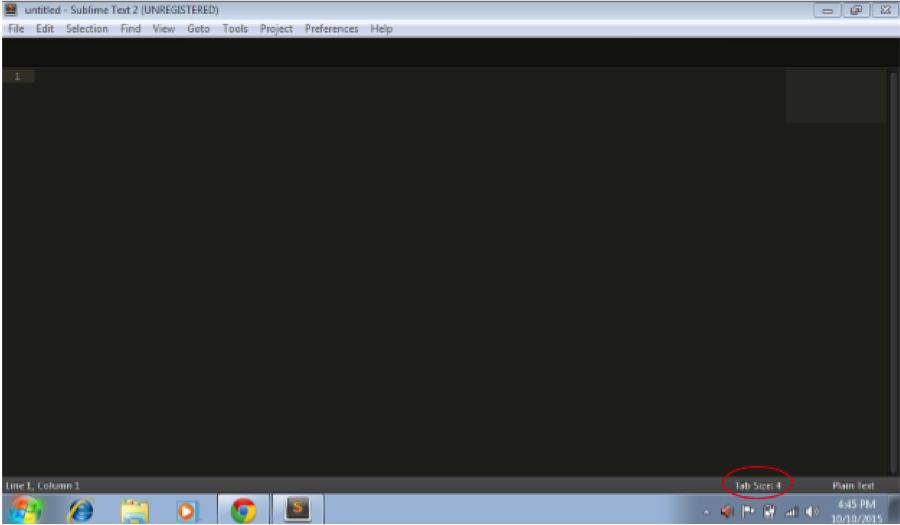
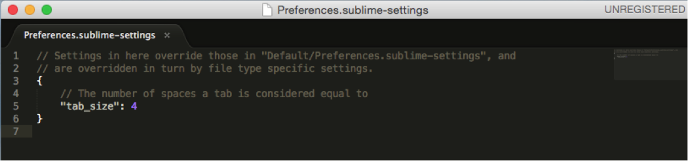
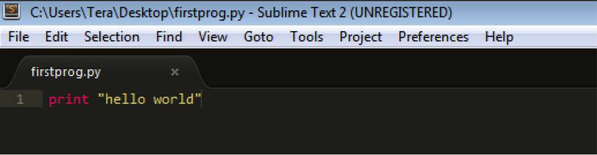

..  Copyright (C)  Brad Miller, David Ranum, Jeffrey Elkner, Peter Wentworth, Allen B. Downey, Chris
    Meyers, Dario Mitchell, Paul Resnick.  Permission is granted to copy, distribute
    and/or modify this document under the terms of the GNU Free Documentation
    License, Version 1.3 or any later version published by the Free Software
    Foundation; with Invariant Sections being Forward, Prefaces, and
    Contributor List, no Front-Cover Texts, and no Back-Cover Texts.  A copy of
    the license is included in the section entitled "GNU Free Documentation
    License".

.. _text_editor_installation:

Installing a Text Editor
========================

You will need a text editor. There are many options for this. For example, serious
programmers often use Eclipse or XCode, which are environments that include some useful tools, or Vim or Emacs, which are text editors that you can use inside the command prompt, which require learning a lot of keyboard commands. We do not recommend those for beginners programming -- better to focus on the problem-solving itself, and there's a lot of stuff to configure in those that you don't need right now. (Many serious programmers don't use those either!) 

Definitely **do not** use MS Word. Word will not save files in the right format, so you will not be able to run programs, and it doesn't do any syntax highlighting or other useful things. Default programs that come with your operating system like TextEdit for Mac or plain Notepad for Windows are also not a good idea -- this can lead to file formatting issues, and you won't have syntax highlighting and other useful features. 

.. _windows_install:

Windows Instructions
====================

The editor that we will help you to use is called **Sublime Text**. Please download it from
`this site <http://www.sublimetext.com/2>`_. Download it and then run the installer to install Sublime Text, like you would most programs you download. Specifically,

1. Click the Windows link.
2. By default, ‘Sublime Text 2.0.2 Setup.exe’ should save to your Downloads folder.
3. Find and double click it.
4. Security Warning windows may appear, click ‘Run’ and then ‘Yes’.
5. Follow the Setup Wizard steps.

Sublime Text may be downloaded and evaluated for free, and there is currently no enforced time limit for the evaluation. However, after evaluation, a license must be purchased for continued use.

Once installation is complete, go to your start menu, select ‘All Programs,’ and find and open Sublime Text 2. The default tab size should be set to 4.

    
If it is not, you should make some configuration changes in Sublime Text to make sure that your spaces will be consistent. (Indenting matters in Python, as you know, and it also matters whether your indentations are spaces or tabs – these are different, even when they look the same to us humans.) To make sure this will not cause you problems, do the following:
Go to the menu at the top, to **Preferences > Settings - User**. Enter the following between the curly brackets: 

// The number of spaces a tab is considered equal to

"tab_size": 4

Then go to File > Save.

It should look like this:

Follow the instructions below. It should be quite intuitive. The one thing to keep in mind is that Sublime Text is an environment for creating python programs. It doesn’t run them! You’ll have to install a little more stuff to run your programs, as described in later sections.
Start Sublime Text from either a Desktop icon or from the Start Programs menu and enter your first Python program:

.. image:: Figures/Sublime_Win3.png
  :width: 600px

Save your program as ``firstprog.py`` in your 106 folder. You will notice that after you save the file, Sublime Text will color your code based on the Python syntax rules. Syntax coloring is a very helpful feature as it gives you visual feedback about your program and can help you track down syntax errors more easily. Sublime Text only knows that your file is a Python file after you save it with a ``.py`` suffix, also known as file extension. It's like the ``.txt`` file extension we've seen that means a file is a plain text file, except this ``.py`` extension means that this file is a Python program.

.. _mac_install:

Mac Instructions
================

The editor that we will help you to use is called **Sublime Text**. Please download it from
`this site <http://www.sublimetext.com/2>`_. Download it and then run the installer to install Sublime Text, like you would most programs you download. Specifically,
1. Click the OS X link (make sure that your operating system is OS X 10.6 or later).
2. Save the .dmg file somewhere you can easily find it (e.g., desktop).
3. Double click this file.
4. This will open the window below. Drag the Sublime Text 2 icon into the Applications folder.

   .. image:: Figures/Sublime_Mac1.png
      :width: 300px

Sublime Text may be downloaded and evaluated for free, and there is currently no enforced time limit for the evaluation. However, after evaluation, a license must be purchased for continued use.

Follow the instructions. It should be quite intuitive. Keep in mind the concepts from earlier – Sublime Text is an environment (a piece of software) for creating python programs. It’s not intended (in this course) for running them!
Start Sublime Text from a Dock shortcut icon, finding it in your Applications folder, or startinit from Spotlight. The default tab size should be set to 4.

   .. image:: Figures/Sublime_Mac2.png
      :width: 300px

If it is not, you should make some configuration changes in Sublime Text to make sure that your spaces will be consistent. (Indenting matters in Python, as you know, and it also matters whether your indentations are spaces or tabs – these are different, even when they look the same to us humans.) To make sure this will not cause you problems, do the following:
Go to the menu at the top, to **Sublime Text 2 > Preferences > Settings - User**. Enter the following between the curly brackets: 

// The number of spaces a tab is considered equal to

"tab_size": 4

Then go to File > Save.

It should look like this:

   .. image:: Figures/Sublime_Mac3.png
      :width: 300px

If you run into any indentation problems while using Sublime Text when you do not expect to, you should check all your code carefully, then repeat that process, or ask the Instructional Team/your classmates to help you debug the problem!

Now, enter your first Python program into Sublime Text:

   .. image:: Figures/Sublime_Mac4.png
      :width: 300px
    
Save your program as ``firstprog.py``, in your 106 folder. You will notice that after you save the file, Sublime Text will color your code based on the Python syntax rules. That's because you saved it with the ``.py`` file extension, which tells the computer this file is a Python program.

Syntax coloring is a very helpful feature, as it gives you visual feedback about your program and can help you track down syntax errors more easily. 
Sublime Text only knows that your file is a Python file after you save it with a ``.py`` suffix, also known as file extension. It's like the ``.txt`` file extension we've seen that means a file is a plain text file, except this ``.py`` extension means that this file is a Python program.

   .. image:: Figures/Sublime_Mac5.png
      :width: 300px

