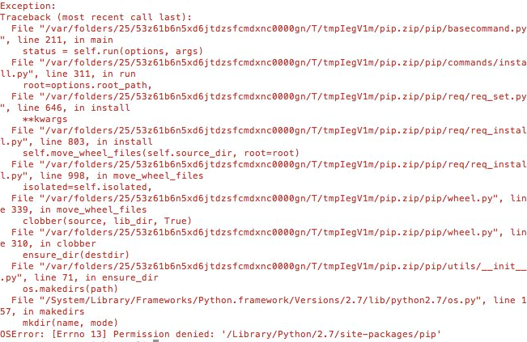
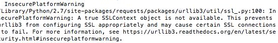
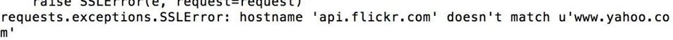

..  Copyright (C)  Paul Resnick, Jaclyn Cohen.  Permission is granted to copy, distribute
    and/or modify this document under the terms of the GNU Free Documentation
    License, Version 1.3 or any later version published by the Free Software
    Foundation; with Invariant Sections being Forward, Prefaces, and
    Contributor List, no Front-Cover Texts, and no Back-Cover Texts.  A copy of
    the license is included in the section entitled "GNU Free Documentation
    License".

.. _gotchas_chap: 

Common Problems 
===============

As you run programs in your native Python interpreter, and use the :ref:`pip module installer <pip_chap>` to install modules, you're likely to run into common problems, which may come about due to typos, confusion, or just the unpredicatability of dealing with a lot of interacting systems and files. This chapter is intended to help you sort out these gotchas. (More may be added!)

with your native Python interpreter (all systems)
-------------------------------------------------

**Wrong directory problems**

It's almost certain that at some point, you'll try to run a program, e.g. ``python <saved-program-name>.py``, in your native interpreter via the Command Line, and will see an error like this:

.. image:: Figures/wrongdirectory.png

This can frustrating, but it definitely means that you have not saved a Python program file in the location where you have navigated in the command prompt (or that you've made a typo when typing the command to execute your program). Use the Unix commands you've learned, like ``pwd`` and ``ls``, to figure out what exact location you have navigated to, and what files and directories are accessible. If you are indeed in the wrong place, of course, use ``cd`` to navigate to the correct place -- but maybe use the Finder/My Computer tool or other Unix commands to figure out where exactly you are.

**"Why isn't this happening?" problems**

Related to the wrong-directory-problem is the common problem of executing a file and not seeing the result of the new print statement you put in, for example. When you run a file successfully but you don't see what you expect to see, there are three things to check:

* Have you saved another copy of the program file by a different name or in a different location? This can get very confusing -- we recommend you do not save more than one copy of the same program to avoid this confusion! ``~/Desktop/106/code/psfile.py`` is NOT the same as ``~/Desktop/106/psfile.py``, for example.
* Have you definitely saved the program since you made the change?
* Are you correctly predicting what your code will do?

.. admonition:: Warning. 

   This textbook deals with Python version **2.7**. Any version of 2.7 is OK for *most* code in this textbook, although some requires that it be later than 2.7.9 (more about this below). Python 2.6 and earlier acts a little bit differently in some cases, and Python 3.0 and later versions are quite different. You can read about Python 3.0 -- it has many syntactic differences that also affect some things about how the Python 3.0+ interpreters work.

with your native Python interpreter (MAC)
------------------------------------------

**Permission denied problems**

If you try to do anything on your computer that requires administrative permissions (installing a module, or running a Python program that will install something, for example), you may see a ``Permission Denied`` error like this:

In that case you need to preface the whole command with ``sudo``, if you are on a mac. (You're unlikely to run into this problem for the same reasons if you use Windows.) That ``sudo`` command, which we've referenced elsewhere too, stands for **super user do**. For example, running the program ``get-pip.py`` *installs* something on your computer, so you'll probably eed to do ``sudo python get-pip.py``. "I'm the super user, and I say it's okay, do the thing where you run this program with the Python interpreter and install something."

.. admonition:: Warning. 

   Depending on your computer's setup, it's possible you will use **sudo** as directed, but still get an error that looks like this:

   ``'<your full path>' or its parent directory is not owned by the current user and the debug log has been disabled. Please check the permissions and owner of that directory. If executing pip with sudo, you may want the -H flag.``

   If that happens, run the same command, but with the ``-H`` flag. The H stands for ``HOME``, which basically makes the command you're running (probably the ``pip`` installer) apply to the correct directories in your computer. 

   So for example, instead of running ``sudo pip install requests``, you would run ``sudo -H pip install requests``. It won't change anything else about your installations that you'll notice.

**Insecure Platform Warning problems**

You may run into an error that looks like the following (especially, in this curriculum, when you use the Flickr API, or you may encounter it in other situations as well):

This probably means that you don't have the right version of Python installed. For many things we do in this course, it won't be a problem. If you see an Insecure Platform Warning error and you *also* run into a surprising error in your code, like this:

then, you'll need to upgrade your Python version to at least ``2.7.10``, which you can do `here <https://www.python.org/downloads/release/python-2710/>`_ .

with your native Python interpreter (WINDOWS)
---------------------------------------------

-u and explanation

full PATH

