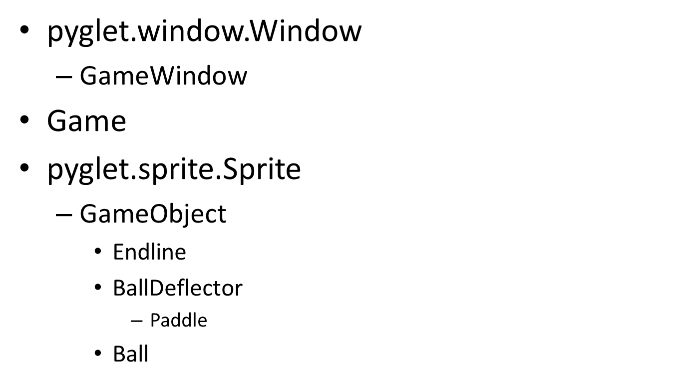
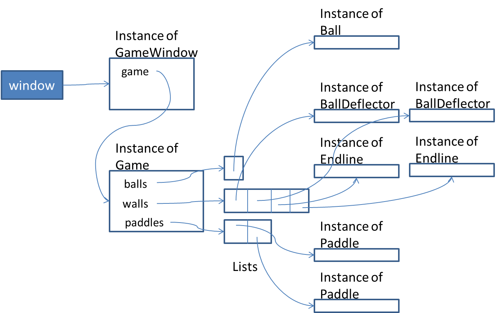

..  Copyright (C)  Sam Carton and Paul Resnick.  Permission is granted to copy, distribute
    and/or modify this document under the terms of the GNU Free Documentation
    License, Version 1.3 or any later version published by the Free Software
    Foundation; with Invariant Sections being Forward, Prefaces, and
    Contributor List, no Front-Cover Texts, and no Back-Cover Texts.  A copy of
    the license is included in the section entitled "GNU Free Documentation
    License".

Pong
=====

To illustrate the power of the Pyglet framework and subclassing, we provide a simple implementation of Pong, the original Atari arcade game.

Two players control the up and down movement of their paddles using the letters W, S, I, and K. The P key pauses or unpauses the game. And Q quits.

As in the simple game of controlling a white square moving, in the previous section, we define a subclass GameWindow of pyglet.window.Window. It maintains a list of currently pressed keys, which is changed whenever a keypress is initiated or released.

Here we introduce a new class, Game, to keep track of all the elements of the game, including the ball, paddles, and walls, plus counters for the score, etc. The Ball, Paddles, and Walls, are all instances of the Sprite class (or, rather, of subclasses of that class). Thus, they have x,y positions within the window and know how to redisplay themselves.

Using ``schedule_interval``, 20 times per second a method is called which advances the state of the game (e.g., moving the ball and paddles by a few pixels).

We use inheritance to make it simpler to program the ball, paddles, and walls. We define a generic GameObject class. Any instance knows how to move itself by a few pixels, based on a direction (angle) and velocity that are stored as instance variables.

Ball, BallDeflector, and Endline are three subclasses of GameObject.

The Ball class, in addition to the movement capability it inherits from GameObject, on each update checks itself against each of the other game objects (the paddles and walls) to see if it is now colliding with that object. If so, it ask that object to handle the collision.

The Endline class, in addition to what it inherits from GameObject, also handles collision with a ball. Instead of deflecting the ball back, it just resets the game, with the ball restarting in the middle of the window.

The BallDeflector class, in addition to what it inherits from GameObject, has the ability to deflect a ball, giving it a new direction (angle). The top and bottom walls are BallDeflectors.

Paddle is a subclass of BallDeflector. In addition to what it inherits from BallDeflector, it sets its direction and velocity based on what keys are currently pressed. For example, if W is pressed for the left paddle, it will set the direction to be straight up; if S is pressed, it sets the direction of movement to be straight down.

Thus, we can summarize the class/subclass relations of all the classes used:

The diagram below shows the structure of the objects that will be created when we run the program. The instance of Game maintains instance variables balls, walls, and paddles that each are lists of object instances, always an instance of the appropriate subclass of GameObject.

We provide the complete code listing below.

.. code:: python

    __author__ = 'Sam Carton and Paul Resnick'

    import pyglet
    import random
    import math

    debug = True

    def as_cartesian(velocity,angle):
        if angle is None:
            return 0,0
        else:
            return velocity*math.cos(math.radians(angle)),velocity*math.sin(math.radians(angle))

    def sign(num):
        if num >= 0:
            return 1
        else:
            return -1

    class GameObject(pyglet.sprite.Sprite):

        def __init__(self, img_file = None, initial_x = 0, initial_y = 0, game = None):
            pyglet.sprite.Sprite.__init__(self, img_file, initial_x, initial_y)
            self.game = game

            self.initial_x = initial_x
            self.initial_y = initial_y

            self.set_initial_position()

        def set_initial_position(self):
            # set_position method is inherited from Sprite class
            self.set_position(self.initial_x,self.initial_y)
            self.velocity = 0.0
            self.angle = None

        def move(self):
            '''
            Move this game object one unit forward in the direction of its velocity.
            :return:
            '''
            x_vel,y_vel = as_cartesian(self.velocity, self.angle)
            self.set_position(self.x + int(x_vel), self.y + int(y_vel))

        def update(self,pressed_keys):
            self.move()

    class BallDeflector(GameObject):

        def deflect_ball(self,ball,side_hit):
            '''
            Deflect a ball that has collided with this object.
            :param ball:
            '''

            if side_hit == 'RIGHT' or side_hit == 'LEFT':
                ball.angle = (180-ball.angle) % 360
            elif side_hit == 'BOTTOM' or side_hit == 'TOP':
                ball.angle = (- ball.angle) % 360

            self.shunt(ball)

        def shunt(self, ball):
            # Shunt the ball in its new direction by enough so that it is no longer overlapping with self.
            # This avoids processing multiple collisions of self and ball before the ball "escapes"
            while ball.colliding_with(self):
                ball.move()
                if (ball.x < 0) or (ball.y < 0):
                    foobar

    class EndLine(BallDeflector):

        def deflect_ball(self, ball, side_hit):
            print "hit an endline"
            if side_hit == 'LEFT':
                # ball approached from the left to right wall
                self.game.reset()
            elif side_hit == 'RIGHT':
                # ball approached from the right
                self.game.reset()
            else:
                # Shouldn't happen. Must have miscalculated which side was hit, since this is an endline
                raise Exception(side_hit)

    class Ball(GameObject):

        default_velocity = 6.0 #Number of pixels the ball should move per game cycle

        def update(self,pressed_keys):
            self.move()
            if self.in_play:
                for game_object in self.game.game_objects:
                    side_hit = self.colliding_with(game_object)
                    if side_hit:
                        game_object.deflect_ball(self, side_hit)

        def set_initial_position(self):
            self.set_position(self.initial_x, self.initial_y)
            self.velocity = self.default_velocity
            self.angle = self.generate_random_starting_angle()
            self.in_play = True

        def generate_random_starting_angle(self):
            '''
            Generate a random angle that isn't too close to straight up and down or straight side to side
            :return: an angle in degrees
            '''
            angle = random.randint(15,75)+90*random.randint(0,3)
            debug_print('Starting ball angle: ' + str(angle) + ' degrees')
            return angle

        def colliding_with(self,game_object):
            '''
            self is a ball and game_object is some other game_object.
            If their bounding boxes (the space they take up on screen) don't overlap,
            return False.
            If they do overlap, return one of 'LEFT', 'RIGHT', 'TOP', 'BOTTOM',
            indicating which edge of game_object the ball has hit.

            Note: this code is complicated, in part because of the geometric reasoning.
            You don't have to understand how this method is implemented, but you will
            need to understand what it does-- figure out which side of the game_object, if any,
            the ball collided with first.
            '''

            # x_distance is difference between rightmost object's left-side (x) and the other's right side (x+width)
            if (self.x < game_object.x):
                left, right = self, game_object
            else:
                left, right = game_object, self
            x_distance = right.x - (left.x + left.width)
            # y_distance is difference between one object's bottom-side (y) and the other's top side (y + height)
            if (self.y < game_object.y):
                bottom, top = self, game_object
            else:
                bottom, top = game_object, self
            y_distance = top.y - (bottom.y+ bottom.height)

            if (x_distance > 0) or (y_distance > 0):
                 # no overlap
                return False
            else:
                # figure out which side of game_object self hit
                # first, special cases of horizontal or vertical approach angle
                special_cases = {0: 'LEFT', 90: 'BOTTOM', 180: 'RIGHT', 270: 'TOP'}
                if self.angle in special_cases:
                    return special_cases[self.angle]
                else:
                    # Decide base on self's y position at the point where they intersected in the x-dimension
                    (x_vel, y_vel) = as_cartesian(self.velocity, self.angle)
                    slope = y_vel / x_vel
                    # go x_distance units either forward or back in x dimension; multiply by slope to get offset in y dimension
                    y_at_x_collision = self.y - sign(y_vel)*math.fabs(x_distance * slope)
                    if (self.angle < 90):
                        # coming from below left, check if top of self was below game_object
                        if y_at_x_collision + self.height < game_object.y:
                            return 'BOTTOM'
                        else:
                            return 'LEFT'
                    elif (self.angle < 180):
                        # coming from below right, check if top of self was below game_object
                        if y_at_x_collision + self.height < game_object.y:
                            return 'BOTTOM'
                        else:
                            return 'RIGHT'
                    elif self.angle < 270:
                        # coming from above right, check if bottom of self was above game_object
                        if y_at_x_collision > game_object.y + game_object.height:
                            return 'TOP'
                        else:
                            return 'RIGHT'
                    else:
                        # coming from above right, check if bottom of self was above game_object
                        if y_at_x_collision > game_object.y + game_object.height:
                            return 'TOP'
                        else:
                            return 'LEFT'

        def deflect_ball(self, ball, side_hit):
            # balls don't deflect other balls
            pass

    class Paddle (BallDeflector):

        default_velocity = 4.0

        def __init__(self, player = None, up_key =None, down_key =None, left_key = None, right_key = None,
            name = None, img_file = None,
            initial_x = 0, initial_y = 0, game=None):
            BallDeflector.__init__(self, img_file=img_file,initial_x=initial_x,initial_y=initial_y, game=game)
            self.player = player
            self.up_key = up_key
            self.down_key = down_key
            self.left_key = left_key
            self.right_key = right_key
            self.name = name

        def update(self,pressed_keys):

            self.velocity = self.default_velocity
            if self.up_key in pressed_keys and not self.down_key in pressed_keys:
                 self.angle = 90
            elif self.down_key in pressed_keys and not self.up_key in pressed_keys:
                self.angle = 270
            elif self.left_key in pressed_keys and not self.right_key in pressed_keys:
                self.angle = 180
            elif self.right_key in pressed_keys and not self.left_key in pressed_keys:
                self.angle = 0
            else:
                self.velocity = 0.0
                self.angle = None

            self.move()

        def hit_position(self, ball):
            '''
            Returns a number between 0 and 1, representing how far up the paddle the ball hit.
            If it hit near the top, the number will be close to 1.
            '''

            virtual_height = self.height + ball.height
            y_dist = ball.y + ball.height - self.y
            pct = y_dist / float(virtual_height)
            return pct

    class Game(object):
        side_paddle_buffer = 50 # how far away from the side wall a paddle should start
        aux_paddle_buffer = 550 # how far away a forward paddle should start
        def __init__(self,
            ball_img = None,
            paddle_imgs=None,
            wall_imgs = None,
            width = 800,
            height = 450,
            game_window=None,
            wall_width = 10,
            paddle_width = 25,
            brick_height = 40):

            self.score = [0,0]
            self.width = width
            self.height = height
            self.game_window = game_window
            self.hit_count = 0

            self.balls = [Ball(img_file= ball_img,
                             initial_x= self.width/2,
                             initial_y = self.height/2,
                             game=self)
                          ]
            self.paddles = [
                Paddle(player = 1,
                        up_key=pyglet.window.key.W,
                        down_key=pyglet.window.key.S,
                        name ='Player 1',
                        img_file = paddle_imgs[0],
                        initial_x= self.side_paddle_buffer + paddle_width/2,
                        initial_y = self.height/2,
                        game=self
                        ),
                Paddle(player = 2,
                        up_key=pyglet.window.key.U,
                        down_key=pyglet.window.key.J,
                        name='Player 2',
                        img_file=paddle_imgs[1],
                        initial_x = self.width-self.side_paddle_buffer - paddle_width/2,
                        initial_y = self.height/2,
                        game=self)        ]
            self.walls = [
                BallDeflector(initial_x = 0, #bottom
                    initial_y = 0,
                    img_file = wall_imgs[1],
                    game = self),
                BallDeflector(initial_x = 0, #top
                    initial_y = self.height - wall_width,
                    img_file = wall_imgs[1],
                    game = self),
                EndLine(initial_x = 0, #left
                    initial_y = 0,
                    img_file = wall_imgs[0],
                    game = self),
                EndLine(initial_x = self.width - wall_width, #right
                    initial_y = 0,
                    img_file = wall_imgs[0],
                    game = self),
            ]
            self.bricks = []  # Not used in this initial version
            self.game_objects = self.walls + self.bricks + self.paddles + self.balls

        def update(self,pressed_keys):
            '''
            Update the game based on the current state of its game objects and the set of keys currently
            being pressed
            :param pressed_keys: a set() object containing an int representing each key currently being pressed
            The matching between numbers and keys is defined by Pyglet. For example, pyglet.window.key.W is
            equal to 119
            :return:
            '''
            # debug_print('Updating game state with currently pressed keys : ' + str(pressed_keys))
            for game_object in self.game_objects:
                game_object.update(pressed_keys)

        def reset(self,pause=True):
            # self.score = [0,0]
            for game_object in self.game_objects:
                game_object.set_initial_position()

            self.hit_count = 0
            debug_print('Game reset')
            self.game_window.redraw()

            if pause:
                debug_print('Pausing. Hit P to unpause')
                self.game_window.pause()

        def draw(self):
            for game_object in self.game_objects:
                game_object.draw()

        def increment_hit_count(self):
            # this method will be used in an exercise in discussion section
            self.hit_count += 1

    class GameWindow(pyglet.window.Window):

        def __init__(self, ball_img, paddle_imgs, wall_imgs,
            width = 800, height = 450,*args,**kwargs):

            pyglet.window.Window.__init__(self, width=width, height=height,*args, **kwargs)
            self.paused = False
            self.game = Game(ball_img,paddle_imgs, wall_imgs, width,height,self)
            self.currently_pressed_keys = set() #At any given moment, this holds the keys that are currently being pressed. This gets passed to Game.update() to help it decide how to move its various game objects
            self.score_label = pyglet.text.Label('Score: 0 - 0',
                              font_name='Times New Roman',
                              font_size=14,
                              x=width-75, y=height-25,
                              anchor_x='center', anchor_y='center')

            # Decide how often we want to update the game, which involves
            # first telling the game object to update itself and all its objects
            # and then rendering the updated game using
            self.fps = 20 #Number of frames per seconds

            #This tells Pyglet to call Window.update() once every fps-th of a second
            pyglet.clock.schedule_interval(self.update, 1.0/self.fps)
            pyglet.clock.set_fps_limit(self.fps)

        def on_key_press(self, symbol, modifiers):
            '''
            This is an overwrite of pyglet.window.Window.on_key_press()
            This gets called by the pyglet engine whenever a key is pressed. Whenever that happens,
            we want to add each key being pressed to the set of currently-pressed keys if it isn't
            already in there
            That's if the key pressed isn't 'Q' or 'Esc'. If it is, then just quit.
            :param symbol: a single key identified as an int
            :param modifiers: I don't know what this is. I am ignoring this.
            :return:
            '''

            if symbol == pyglet.window.key.Q or symbol == pyglet.window.key.ESCAPE:
                debug_print('Exit key detected. Exiting game...')
                pyglet.app.exit()
            elif symbol == pyglet.window.key.R:
                debug_print('Resetting...')
                self.game.reset()
            elif symbol == pyglet.window.key.P:
                if not self.paused:
                    self.pause()
                else:
                    self.unpause()
            elif not symbol in self.currently_pressed_keys:
                self.currently_pressed_keys.add(symbol)

        def pause(self):
            debug_print('Pausing')
            pyglet.clock.unschedule(self.update)
            self.paused = True

        def unpause(self):
            debug_print('Unpausing')
            pyglet.clock.schedule_interval(self.update, 1.0/self.fps)
            self.paused = False

        def on_key_release(self, symbol, modifiers):
            if symbol in self.currently_pressed_keys:
                self.currently_pressed_keys.remove(symbol)

        def update(self,*args,**kwargs):
            self.game.update(self.currently_pressed_keys)
            self.redraw()

        def redraw(self):
            self.clear()
            self.game.draw()
            self.score_label.draw()

        def redraw_label(self):
            self.score_label.text = 'Score: ' + str(self.game.score[0]) + ' - ' + str(self.game.score[1])

    def debug_print(string):
        '''
        A little convenience function that prints the string if the global debug variable is True,
        and otherwise does nothing
        :param string:
        :return:
        '''
        if debug:
            print string

    def main():
        debug_print("Initializing window...")
        ball_img = pyglet.resource.image('ball.png')
        # ball_img = pyglet.resource.image('vertical_wall.png')
        paddle_imgs = [pyglet.resource.image('paddle1.png'),
                       pyglet.resource.image('paddle2.png')]
        wall_imgs = [pyglet.resource.image('vertical_wall.png'),
                     pyglet.resource.image('horizontal_wall.png'),
                     pyglet.resource.image('brick.png')]
        window = GameWindow(ball_img,paddle_imgs, wall_imgs)
        debug_print("Done initializing window! Initializing app...")

        pyglet.app.run()

    if __name__ == "__main__":
        main()

