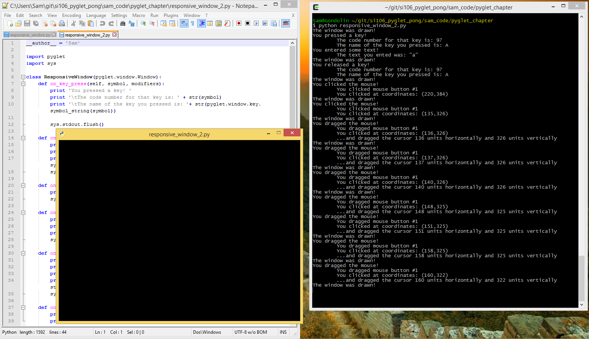

..  Copyright (C)  Sam Carton and Paul Resnick.  Permission is granted to copy, distribute
    and/or modify this document under the terms of the GNU Free Documentation
    License, Version 1.3 or any later version published by the Free Software
    Foundation; with Invariant Sections being Forward, Prefaces, and
    Contributor List, no Front-Cover Texts, and no Back-Cover Texts.  A copy of
    the license is included in the section entitled "GNU Free Documentation
    License".

Listening for events
--------------------

**Pyglet windows can listen for events.** When we say that, we don't mean that they literally listen for anything. What we mean is that when you have a window in focus, it knows when a user does different things, such as:

- Mouse clicks

- Key presses

- Window resizing

- Lots of other stuff. The full list of listener functions can be found here_, under the "Events" heading.

.. _here: https://pyglet.readthedocs.org/en/pyglet-1.2-maintenance/api/pyglet/window/pyglet.window.Window.html#pyglet.window.Window.on_activate

Unfortunately, the default Pyglet window, the one we create when we say ``window = pyglet.window.Window()``, is boring. It can detect all these different kinds of events, but it doesn't actually do anything when any of them happen.

If you want a window that will respond to user events, you have to make it yourself, by **subclassing** the ``pyglet.window.Window`` class. In particular, you have to **overwrite** the methods of the Window class that are responsible for responding to user events.

Listening for Key Presses
~~~~~~~~~~~~~~~~~~~~~~~~~

Here, we have created a subclass of ``pyglet.window.Window`` that we call ``ResponsiveWindow``. ``ResponsiveWindow`` overwrites the ``on_key_press()`` method of ``pyglet.window.Window``, which gets called whenever a key is pressed while the window is in focus.

.. code:: python

    import pyglet
    import sys

    class ResponsiveWindow(pyglet.window.Window):
        def on_key_press(self, symbol, modifiers):
            print 'You pressed a key! '
            print '\tThe code number for that key is: ' + str(symbol)
            print '\tThe name of the key you pressed is: '+ str(pyglet.window.key.symbol_string(symbol))
            print '---'
            sys.stdout.flush()

    responsive_window = ResponsiveWindow()
    pyglet.app.run()

If you run this code, you'll get a window which is still empty, but which prints out any key you press as a console message:

.. image:: Images/responsive_window.png

Try not to worry too much about the ``sys.stdout.flush()`` business. That is just a bit of finagling to make sure that the output is sent to the terminal window right away (flushed) rather than being saved for later output.

Behind the scenes, the Pyglet event loop is monitoring (listening) for key presses, mouse clicks, and some other things. When one of those events occurs, it figures out which Window is active and calls the corresponding method, such as ``on_key_press()`` for a key press. The built-in method of the Window class doesn't do anything. But we made a subclass where that method does something, printing out information about the key that was pressed.

.. note::

    This is a big conceptual departure from all the programming we've done until now. Previously, we have defined functions (and methods) and then we wrote code that caused those functions (and methods) to be invoked. Now, we are not controlling exactly when the functions will be invoked. Instead, pyglet has its listener loop, which gets notified by the operating system whenever there is a new user input such as a key press. pyglet then figures out which instance of the Window class was active and tries to call a method on that instance. It looks for a method with a very particular name, in this case, ``on_key_press``. If you name your method even a little differently, say ``onkeypress``, pyglet won't invoke the method. If there's code that you want to have executed whenever a particular event happens, you have to figure out what method pyglet will call in response to that event, and define that method.

So, to recap: we **subclassed** the ``pyglet.window.Window`` class, and wrote the ``on_key_press()`` method, overwriting the on_key_press method in Pyglet's Window class. That changed how our subclass responded to key presses.

Other Kinds of Events
~~~~~~~~~~~~~~~~~~~~~

A good question at this point would be: **"What are the major event listener methods you can overwrite, and how do they work?"**
Because we are working with an existing framework, Pyglet, we need to understand what special method names it knows about, so we know which ones are good ones for use to override in the subclass that we define.

The answer can, again, be found in `the official documentation <https://pyglet.readthedocs.org/en/pyglet-1.2-maintenance/api/pyglet/window/pyglet.window.Window.html#pyglet.window.Window.on_activate>`_. Some of the most important ones are:

Window.on_key_press(symbol,modifiers)
    This gets called whenever a key is pressed. ``symbol`` is a numeric code for the key that was pressed (e.g. 97 for 'A'), and ``modifiers`` is a number representing any other keys that are being held down at the same time (useful if you wanted to differentiate shift+A from just A, for instance.)

Window.on_key_release(symbol, modifiers)
    This is very similar to ``on_key_press()``, only it gets called when a key is released (i.e., when the user takes their finger off the key).

Window.on_mouse_press(x, y, button, modifiers)
    This method gets called whenever the mouse is clicked inside the window. ``x`` and ``y`` represent the coordinates inside the window where the press happened, and ``button`` represents which mouse button was clicked (e.g. 1 for the left mouse button). ``modifiers`` again represents any other keys currently being pressed, to differentiate between, say, shift-clicking and normal clicking.

Window.on_mouse_drag(x, y, dx,dy, button, modifiers)
    This method gets called whenever the mouse is dragged from one point in the window to a different point while a button is clicked. ``x`` and ``y`` represent the coordinates of the initial point, and ``dx`` and ``dy`` represent how far in the x and y direction the mouse was dragged from its original spot when the button was clicked. This may seem a little surprising, since mouse dragging is a continuous operation, not a one-time thing like pressing down a key. Remember, though, that computers are super fast! What happens is that when you move the mouse across the screen, ``on_mouse_drag()`` will get called many times, each with a new dx and dy.

Window.on_draw()
    This method is an important one. It gets called automatically when the window is first drawn, and after lots of other events, like keypresses. If there is something that you always want to be in the window no matter what, then you should put it inside this method, so that it will be redrawn every time.

Window.on_text(text)
    This method is sort of an alternative to on_key_press() for when you just want to interpret user input as text. ``text`` is the text that was entered. This will get called once for each individual key that is pressed.

There are lots more of these things, which cover events such as the window being closed, the window being opened, the mouse being moved without clicking, the window being resized, etc. Check the documentation to see the whole set.

Below is a version of the ResponsiveWindow class which has an overwritten method for each of those event handlers:

.. code:: python

    import pyglet
    import sys

    class ResponsiveWindow(pyglet.window.Window):
        def on_key_press(self, symbol, modifiers):
            print 'You pressed a key! '
            print '\tThe code number for that key is: ' + str(symbol)
            print '\tThe name of the key you pressed is: '+ str(pyglet.window.key.symbol_string(symbol))

            sys.stdout.flush()

        def on_key_release(self, symbol, modifiers):
            print 'You released a key! '
            print '\tThe code number for that key is: ' + str(symbol)
            print '\tThe name of the key you pressed is: '+ str(pyglet.window.key.symbol_string(symbol))
            sys.stdout.flush()

        def on_draw(self):
            print 'The window was drawn!'
            sys.stdout.flush()

        def on_mouse_press(self,x, y, button, modifiers):
            print 'You clicked the mouse!'
            print '\tYou clicked mouse button #'+str(button)
            print '\tYou clicked at coordinates: (' +str(x) + ',' + str(y) + ')'
            sys.stdout.flush()

        def on_mouse_drag(self,x, y, dx, dy, button, modifiers):
            print 'You dragged the mouse!'
            print '\tYou dragged mouse button #'+str(button)
            print '\tYou clicked at coordinates: (' +str(x) + ',' + str(y) + ')'
            print '\t...and dragged the cursor ' +str(x) + ' units horizontally and ' + str(y) + ' units vertically'
            sys.stdout.flush()

        def on_text(self,text):
            print 'You entered some text!'
            print '\tThe text you entered was: "'+text+'"'

    responsive_window = ResponsiveWindow()
    pyglet.app.run()

If you run this code and click the mouse a little, and press a few keys, you should see some output in the console that's similar to what's shown below.

Pyglet event loop revisited
~~~~~~~~~~~~~~~~~~~~~~~~~~~

As a final note on event listeners, this is what we meant by the "Pyglet event loop" we mentioned above. While the window is open, Pyglet is just looping around again and again, "listening" at each loop for things happening on the keyboard or the mouse, or what-have-you. If something happens, it calls the appropriate function, such as on_key_press(). If nothing happens, it does nothing.

