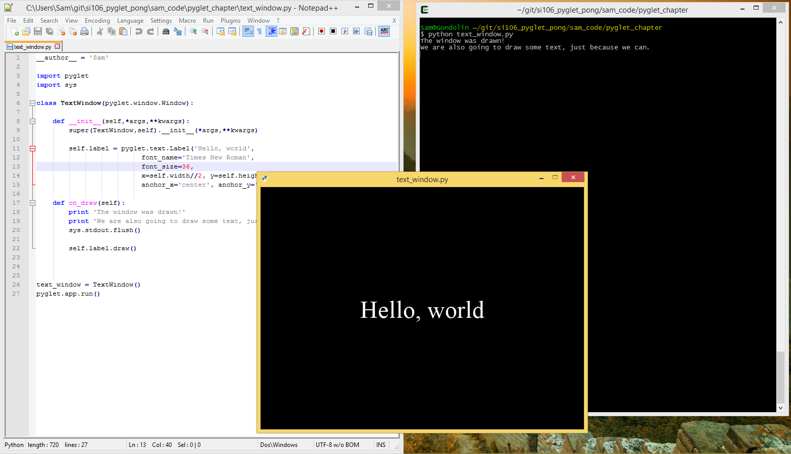
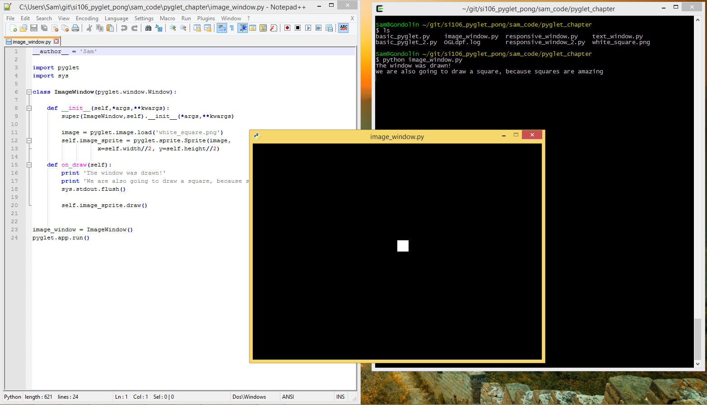

..  Copyright (C)  Sam Carton and Paul Resnick.  Permission is granted to copy, distribute
    and/or modify this document under the terms of the GNU Free Documentation
    License, Version 1.3 or any later version published by the Free Software
    Foundation; with Invariant Sections being Forward, Prefaces, and
    Contributor List, no Front-Cover Texts, and no Back-Cover Texts.  A copy of
    the license is included in the section entitled "GNU Free Documentation
    License".

Drawing text and images
-----------------------

Okay! At this point, you are probably wondering why we haven't shown you how to do anything other than create boring, empty windows. The truth is that you can draw all sorts of cool stuff inside a window, but it has to be in the context of an event handling function. So you had to understand event handling before trying to draw anything.

The on_draw() method
~~~~~~~~~~~~~~~~~~~~

When you call pyglet.app.run, it not only draws each Window instance on the screen, but also calls the on_draw() method for each Window instance. In the on_draw() method, we can put code that causes text or graphics to be drawn.

Conveniently, whenever any event is handled by a Window instance, pyglet clears the text and graphics and calls the on_draw() method again. That way, the contents of the window can change in response to user inputs.

Displaying text
~~~~~~~~~~~~~~~

For starters, though, here is some code that will draw some text in a non-responsive window:

.. code:: python

    import pyglet
    import sys

    class TextWindow(pyglet.window.Window):

        def __init__(self,*args,**kwargs):
            pyglet.window.Window.__init__(self, *args,**kwargs)

            self.label = pyglet.text.Label('Hello, world',
                              font_name='Times New Roman',
                              font_size=36,
                              x=self.width//2,
                              y=self.height//2,
                              anchor_x='center', anchor_y='center')

        def on_draw(self):
            print 'The window was drawn!'
            print 'We are also going to draw some text, just because we can.'
            sys.stdout.flush()

            self.label.draw()

    text_window = TextWindow()
    pyglet.app.run()

We did a couple new things here. First, we overwrote not just the ``on_draw()`` method of ``pyglet.window.Window``, but also its constructor, ``__init__``. Our version of the constructor doesn't do all that much. Mostly, it just passes its input arguments on to the base constructor for ``pyglet.window.Window``. However, it does one crucial extra thing: it creates a ``pyglet.text.Label`` object called ``label`` and saves it as an instance variable.

The x and y values passed into the constructor for the Label class specify a location within the window where the text label should be drawn. The lower left corner of the window is (0, 0) and the unit of measurement is one pixel. Here, we are setting the location to be in the middle of the window, with x set to half the window's width and y set to half its height.

Then, in the ``on_draw()`` method, it looks up that Label instance, as ``self.label``, and calls the ``draw()`` method of this object, which tells the label to draw itself (in its containing window).

And so, voila! We've succeeded in drawing something in our window:

For more information on displaying and formatting text, check the following documentation page: https://pyglet.readthedocs.org/en/pyglet-1.2-maintenance/programming_guide/text.html

Displaying Images
~~~~~~~~~~~~~~~~~

Displaying an image is similar to displaying a label. You'll have to create an object to hold the image, and then use the draw() method of that object to actually display it in the window. Rather than a ``pyglet.text.Label``, we'll use a ``pyglet.sprite.Sprite``.

With images, there is an extra step involved: loading the image from the file system. To do this, we'll use the ``pyglet.image.load()`` function.

Here's some code that shows how these elements work together to display an image. It depends on a file named 'white_square.png' existing in the same directory as the .py file, so if you want to try it out you will have to supply your own image (available on Canvas for 106 students):

.. code:: python

    import pyglet
    import sys

    class ImageWindow(pyglet.window.Window):

        def __init__(self,*args,**kwargs):
            pyglet.window.Window.__init__(self, *args,**kwargs)

            image = pyglet.image.load('white_square.png')
            self.image_sprite = pyglet.sprite.Sprite(image,
                      x=self.width//2, y=self.height//2)

        def on_draw(self):
            print 'The window was drawn!'
            print 'We are also going to draw a square, because squares are amazing'
            sys.stdout.flush()

            self.image_sprite.draw()

    image_window = ImageWindow()
    pyglet.app.run()

Running this code gives the following:

It's worth a little more discussion of the Sprite class, since if you build a visual application such as a game, you are most likely going to be creating and manipulating a lot of Sprites. So: a Sprite represents a persistent game object. The class has a number of instance variables and methods associated with it. Here are a few important ones:

- x and y: these instance variables represent the lower left corner of the Sprite

- set_position(x,y): this method moves the Sprite to a new position. If you want to move a game object in-game, you should use this method.

- width and height: these variables represent the width and height of the Sprite. They are calculated automatically from the image that the Sprite is based on.

- draw(): This method draws the Sprite within its containing window. If you want to have a game object move, one way of doing so is to change its position with set_position(), clear the window using the Window.clear() method, and then draw the Sprite again using this method.

- delete(): This method deletes the Sprite.

The full documentation for the class is available here: http://pyglet.readthedocs.org/en/latest/api/pyglet/sprite/pyglet.sprite.Sprite.html

Displaying Geometric Primitives
~~~~~~~~~~~~~~~~~~~~~~~~~~~~~~~

You can draw geometrics shapes in a window by using the ``pyglet.graphics.draw()`` function.

The syntax for this function goes generally as follows:

.. code:: python

    pyglet.graphics.draw(number_of_vertices,shape_type,shape_tuple)
    # number_of_vertices: number of vertices that will be used to define this shape (e.g. 3 for a triangle)
    # shape_type: one of a set of shape types defined by Pyglet. See https://pyglet.readthedocs.org/en/pyglet-1.2-maintenance/programming_guide/graphics.html#drawing-primitives for the full list.
    # shape_tuple: a two-element tuple of the form (format_string,vertex_tuple)
    # format_string is a string that describes how the tuple_vertex should be interpreted. You can see various options for this in the link above, but sticking with 'v2f' is good to start with.
    # vertex_tuple is a tuple consisting of two elements per vertex, an x coordinate and a y coordinate.

This is probably hard to understand, so here is some code that draws various kinds of shapes:

.. code:: python

    import pyglet
    import sys

    class ShapeWindow(pyglet.window.Window):

        def __init__(self,*args,**kwargs):
            super(ShapeWindow,self).__init__(*args,**kwargs)

        def on_draw(self):
            print 'The window was drawn!'
            print 'We are also going to draw a bunch of different shapes'
            sys.stdout.flush()

            self.draw_points()
            self.draw_line()
            self.draw_triangle()
            self.draw_polygon()

        def draw_points(self):
            pyglet.graphics.draw(3, pyglet.gl.GL_POINTS,
            ('v2i', (10, 10, 100, 100, 200,200)))

        def draw_line(self):
            pyglet.graphics.draw(4, pyglet.gl.GL_LINES,
            ('v2i', (10, 100, 50, 50, 200,100,300,300)))

        def draw_triangle(self):
            pyglet.graphics.draw(3, pyglet.gl.GL_TRIANGLES,
            ('v2i', (500, 100, 600, 300, 550,450)))

        def draw_polygon(self):
            pyglet.graphics.draw(7, pyglet.gl.GL_POLYGON,
            ('v2i', (100, 400, 150, 350, 200,400,250,350,300,450,250,375,200,450)))

    shape_window = ShapeWindow()
    pyglet.app.run()

If we run this code, we should see a window with the various points, lines and shapes we plotted out:

.. image:: Images/shape_window.png
